# Codex ACP VS Code 拡張機能 実装計画

この文書は2026-09-13時点の旧ACP方式の計画です。現在はApp Serverへ移行済みです。[現行の構成と検証](App-Server-Migration.md) を参照してください。

VS Code 内で Codex に依頼し、応答と作業状況を確認できる ACP クライアント拡張機能を開発するための計画書。
確定事項、実装案、段階ごとの完了条件を整理する。作成日: 2026-09-13。

実装後の採用仕様、検証結果と未確認事項は [実装状況](Implementation-Status.md) を参照。以下の現状調査は計画作成時点の記録として残す。

## 1. 目的と確定事項

- `@agentclientprotocol/codex-acp` を利用して Codex と接続する。
- UI は Webview 上で動作させ、Storybook と Playwright で開発・検証する。
- Webview と Extension Host の通信は `src/webview/vscodeBridge.ts` を経由する。
- VS Code API、Node.js、ACP プロセスの操作は Extension Host が担当する。

以下の MVP 範囲と構成は提案であり、ユーザーが指定した確定要件とは区別する。
この計画では、独自の ACP クライアントから Codex を利用する構成を想定する。

## 2. 現在の状態

| 対象           | 確認できた状態                                               | 計画への反映                                      |
| -------------- | ------------------------------------------------------------ | ------------------------------------------------- |
| Extension Host | `src/extension/extension.ts` に Hello World コマンド         | Webview 起動とサービス管理を追加する              |
| Bridge         | `src/webview/vscodeBridge.ts` に送信処理とブラウザ用送信記録 | 型付きの双方向通信と購読解除を追加する            |
| ACP            | `codex-acp` 1.11.0、SDK ^1.4.0 が依存に存在                  | インストール済みバージョンの仕様で接続を検証する  |
| React          | React / React DOM が依存に存在                               | Webview の描画入口と画面を追加する                |
| ビルド         | `esbuild.js` が存在しない `src/extension.ts` を参照          | 最初に実際の配置へ合わせる                        |
| 型設定         | ルートは Node 用で、Webview 用の DOM・TSX 設定がない         | Extension Host とブラウザの型検査を分離する       |
| Storybook      | 設定は存在するが Story は未追加                              | チャット画面の状態別 Story を作成する             |
| Playwright     | 既存 spec は未配置のサンプル Story を参照                    | 実際のチャット Story に対応するシナリオを用意する |
| 拡張機能テスト | 設定は `tests/.vscode-test.mjs`、script は設定パス未指定     | 設定の読み込みとテスト検出を確認する              |

既存ガイドには Webview ディレクトリが未作成との記載があるが、現在は Bridge が存在する。
実装時は実ファイルを正とし、変更に対応するガイドも更新する。上記はファイル調査結果であり、テスト成功の報告ではない。

## 3. 最初に完成させる範囲（MVP 案）

ローカルの VS Code と一つのワークスペースフォルダを対象に、一つの会話を実行できる状態を目指す。

- チャット画面の表示、新規会話、テキスト送信。
- 応答の逐次表示、実行中表示、停止操作。
- ツール実行・ファイル変更の概要表示と、エージェントから届く承認要求への回答。
- 接続中・認証が必要・接続失敗・実行失敗の表示と、再接続の導線。
- 同じ拡張機能の稼働中は、Webview を再表示した際に現在の状態を復元する。

複数会話の並行実行、再起動をまたぐ履歴保存、画像添付、モデル設定 UI、詳細な差分表示、MCP 設定 UI は後続候補とする。
Remote / WSL / Dev Containers、複数フォルダ、VS Code for Web への対応も別途判断する。

## 4. 全体構成案

```mermaid
flowchart LR
    UI[Webview / React] <-->|型付きメッセージ| Bridge[vscodeBridge.ts]
    Bridge <-->|postMessage| Host[Extension Host / メッセージ受付]
    Host <--> Session[セッション管理 / 状態管理]
    Session <--> Client[ACP クライアント / SDK]
    Client <-->|stdio| Adapter[codex-acp プロセス]
    Adapter <--> Codex[Codex 実行基盤]
    Story[Storybook / Playwright] <--> Mock[代替 Bridge]
    Mock <--> UI
```

`codex-acp` は stdio で動作するエージェントとして起動し、Extension Host 内の ACP SDK から接続する案とする。
インストール済みパッケージの README と bin 定義を根拠にし、具体的な起動方法は最初の接続検証で確定する。

| 配置案                            | 責務                                               |
| --------------------------------- | -------------------------------------------------- |
| `src/extension/extension.ts`      | コマンド登録、各サービスの組み立てと破棄           |
| `src/extension/webview/`          | Webview の生成、HTML・CSP、メッセージの受付と検証  |
| `src/extension/acp/`              | 子プロセスの起動・終了、ACP 接続、通知と要求の変換 |
| `src/extension/session/`          | 会話・実行状態・保留中の承認要求の管理             |
| `src/shared/messages.ts`          | 実行環境に依存しない通信型                         |
| `src/webview/vscodeBridge.ts`     | VS Code 通信の入口、受信購読と解除                 |
| `src/webview/`                    | React の入口とアプリの組み立て                     |
| `src/webview/chat/`               | チャット UI、状態更新、CSS、Story                  |
| `tests/` / `tests/e2e/ui-review/` | Host の検証 / Storybook 上の操作・視覚検証         |

実装が必要になった時点でファイルを追加し、1 ファイル 200 行を目安に責務で分割する。
ファイル・関数・型の役割と重要な制約は、日本語コメントで記述する。

## 5. Bridge と状態管理の設計案

React は差し替え可能な Bridge インターフェースを利用し、本番の実装だけが `acquireVsCodeApi()` を呼ぶ。
既存のブラウザ用送信記録を発展させ、Storybook では受信イベントも再現できる代替実装を注入する。
UI の各所から `window.postMessage` や VS Code API を直接呼ばない。

| 方向      | メッセージ例（独自の UI 通信名）                                                                                  |
| --------- | ----------------------------------------------------------------------------------------------------------------- |
| UI → Host | `ui/ready`、`session/new`、`prompt/send`、`prompt/cancel`、`permission/respond`、`connection/retry`               |
| Host → UI | `state/snapshot`、`connection/changed`、`message/delta`、`tool/updated`、`permission/requested`、`request/failed` |

- `type` による判別可能な型を定義し、要求 ID・会話 ID・実行 ID を必要に応じて付ける。
- TypeScript の型だけに依存せず、受信時に種類・必須項目・値を検証する。
- ACP のメッセージを Host で UI 用に変換する。UI が ACP の全仕様へ直接依存することを避ける。
- Host が会話と実行状態の正本を持ち、UI は表示用状態と入力中テキストを管理する。
- UI の準備完了後にスナップショットを送り、その後の差分を適用する。順序番号などで重複や古い通知を判別する。
- 切断時は保留要求を失敗として解決する。再接続時に実行中のプロンプトを自動再送しない。
- 初期版は一会話につき一実行とし、停止後の完了通知や会話切り替え後の遅延通知が別の会話へ混入しないようにする。
- Bridge の受信リスナーは破棄時に解除し、Story ごとに代替実装の状態を初期化する。

## 6. ACP 接続とライフサイクル

想定フローは「起動 → initialize → 必要な認証 → session/new → prompt → 更新通知 → 完了」。
初期化でプロトコル版と能力を確認し、実装済みのクライアント機能だけを通知する。
任意機能は相手の能力に応じて有効化する。[ACP 初期化仕様](https://agentclientprotocol.com/protocol/v1/initialization)

- プロセスの作業ディレクトリは対象ワークスペースに固定し、未選択時の挙動を定義する。
- 開発時はインストール済みパッケージからの起動を検証する。配布時は Node ランタイム、Codex の実行ファイル、依存の同梱範囲を明示する。
- Windows のパスに空白がある場合と子プロセス終了を検証し、標準出力の ACP 通信と標準エラーの診断ログを分ける。
- 認証方法は初期化応答と実際の adapter の挙動を確認して採用する。秘密情報を Webview や診断ログへ渡さない。
- 承認要求は識別子と選択肢を保持し、一度だけ回答する。停止・切断時にも保留状態を解消する。
- エージェントのファイル・コマンド操作と、ACP クライアントが提供するファイル・端末 API の責務を接続検証で確認する。
- Webview から任意のコマンドやパス操作をそのまま実行せず、Host が許可した要求を処理する。Workspace Trust も起動条件に反映する。
- 拡張機能終了時は子プロセス・接続・購読を破棄する。Webview を閉じたときの稼働継続は未決事項として扱う。
- Webview は CSP と読み込み可能なリソース範囲を設定し、応答テキストを未検証の HTML として挿入しない。

## 7. 実装ステップと完了条件

| 段階                  | 作業                                                                     | 完了条件                                                         |
| --------------------- | ------------------------------------------------------------------------ | ---------------------------------------------------------------- |
| 0. 基盤整備           | エントリーポイント修正、Host / Webview の型設定分離、テスト設定の確認    | Host のビルド・型検査が通り、拡張機能テストが 1 件以上実行される |
| 1. 最小の接続検証     | 子プロセス起動、初期化、認証手順、会話作成、1 回の送信と終了             | 実際の Codex から応答を受け取り、起動条件と終了処理を記録できる  |
| 2. UI と通信の土台    | Webview 起動、React 描画、Bridge の双方向通信、代替 Bridge、最初の Story | 実機で往復通信でき、同じ UI が Storybook 単体でも動作する        |
| 3. 会話の統合         | 入力、逐次応答、停止、新規会話、スナップショット復元                     | 実機で送信・停止・再表示でき、二重送信や会話間の混入がない       |
| 4. 操作と障害対応     | ツール状況、承認・拒否、認証エラー、異常終了、再接続                     | 承認待ちを操作でき、停止・切断から操作可能な状態へ戻れる         |
| 5. MVP 検証と配布準備 | 主要 Story / Playwright、実機確認、依存の梱包、導入手順                  | 開発ツリーに依存せずインストールした拡張機能から会話できる       |

段階 1 で起動・認証・配布上の制約を確認してから本格的な画面実装に進む。
日付や工数は未確定とし、この検証結果と MVP の合意後に見積もる。

## 8. UI と検証の計画

UI は接続状態、会話一覧表示領域、入力欄、送信・停止、新規会話、ツール状況、承認要求を基本要素とする。
ここでいう会話一覧表示領域は現在の会話内のメッセージ列であり、複数セッションの管理画面は後続候補とする。

Story は「空状態・接続中・認証が必要・応答中・完了・承認待ち・停止・エラー」を用意する。
長文、コード、狭い幅、明暗テーマ、キーボード操作、日本語 IME の変換確定時の誤送信も確認する。

| 検証層                 | 主な確認内容                                                        |
| ---------------------- | ------------------------------------------------------------------- |
| Host / 通信テスト      | 不正メッセージ、状態遷移、遅延通知、承認の重複回答、プロセス終了    |
| Storybook + Vitest     | UI の表示状態、入力・送信・停止などの局所的な操作                   |
| Playwright UI レビュー | 送信から完了、承認・拒否、エラーから復帰する流れ、画像・動画・trace |
| VS Code 実機           | Webview の読み込み、実際の Bridge、ACP 接続・認証、終了と再表示     |
| インストール後の検証   | 梱包済み UI 資産と実行依存、導入手順だけで起動できること            |

Storybook 上の検証には実際の ACP や認証を必要としない代替実装を使う。
実際の Webview とプロセス接続は別途確認し、ブラウザテストだけで動作保証したことにしない。
UI レビューでは既存の参照先と表示サイズをチャット向けに変更し、生成画像を実際に開いて確認する。

既存コマンドは `pnpm compile`、`pnpm check-types`、`pnpm check-types:tests`、`pnpm test`、
`pnpm build-storybook`、`pnpm test:storybook`、`pnpm ui-review`、`pnpm package` を影響範囲に応じて使う。
Webview・開発設定・Playwright 用の型検査は、既存設定の対象を確認したうえで必要な script を追加する。
テスト 0 件を成功と扱わず、実行したシナリオと未確認事項を記録する。

## 9. 未決事項と判断時期

| 項目                 | 初期案                                                       | 決める時期              |
| -------------------- | ------------------------------------------------------------ | ----------------------- |
| 画面の配置           | サイドバーの WebviewView。広さを優先するなら WebviewPanel    | 段階 2 の前             |
| 認証 UX              | 利用可能な認証方法を確認し、まず一つの導入経路を成立させる   | 段階 1                  |
| 実行環境・配布       | 開発時はローカル依存。配布時のランタイムと同梱方法を検証する | 段階 1 で試作、5 で確定 |
| ファイル・端末機能   | adapter が必要とするクライアント機能を確認して範囲を決める   | 段階 1                  |
| Webview を閉じたとき | 会話状態は Host に保持。進行中の処理を続けるかは別途判断     | 段階 3 の前             |
| 履歴保存             | MVP は稼働中のみ。永続化・保存先・削除操作は後続             | MVP 完了後              |
| 対応 OS              | Windows で先行検証し、公開する対応範囲を実機検証で決める     | 段階 5 の前             |

## 10. 参照資料

- リポジトリの [ディレクトリ構成](../.agents/docs/Directory-Structure.md)、[UI レビュー](../.agents/docs/UI-Review-Guide.md)、[UI レビューの実装](../.agents/docs/UI-Review-Implementation.md)。
- 導入済み `node_modules/@agentclientprotocol/codex-acp/README.md` と `package.json`（1.11.0）。接続検証ではこの版の動作を優先する。
- [ACP 初期化仕様](https://agentclientprotocol.com/protocol/v1/initialization)。公開仕様と導入済み SDK の差異は段階 1 で確認する。
