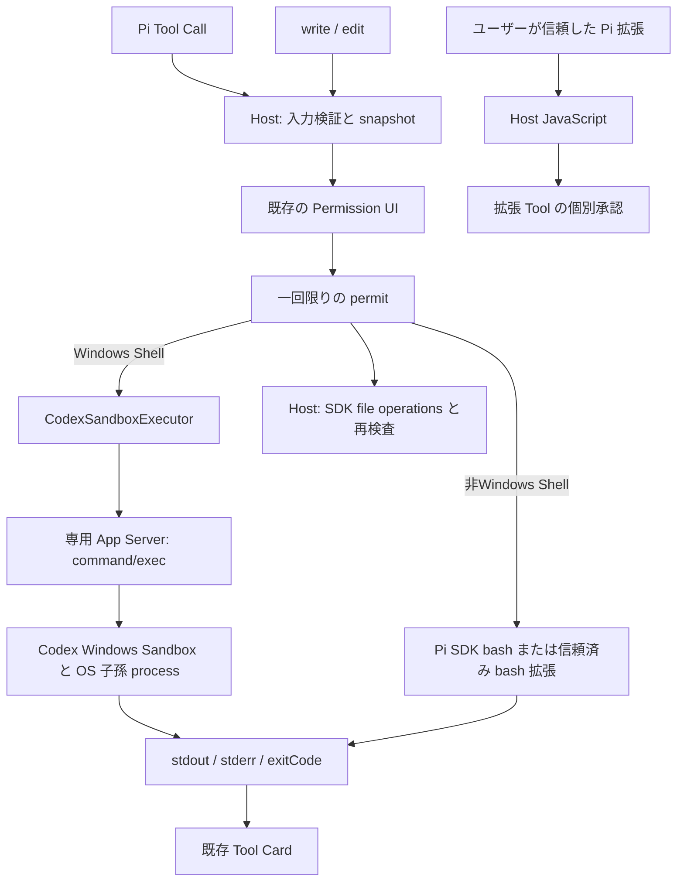

# Phase 11: Sandbox / Approval Architecture

2026-09-24 の Phase 11 再実装仕様に基づく実装・検証記録。**実行委譲を実装したが、Phase 11 全体は未完了**。この Windows 環境では通信隔離に違反する結果が再現している。Windows PowerShell の日本語出力は 2026-09-25 の追加修正で改善を確認した。元の仕様の状態、main、利用者の Trust 設定は変更していない。

## 基点と変更範囲

| 項目                 | 値                                                                                          |
| -------------------- | ------------------------------------------------------------------------------------------- |
| 作業ブランチ         | `phase11-codex-reimplementation`                                                            |
| 着手時の main / HEAD | `b553e7665f2cee21e7c4a8490be09d41fc2ba8a8`                                                  |
| 選択参照した保存版   | `e5f31d606a09722e93f78b5ec7aa3682adaefeb7` (`phase11-astra`)                                |
| 実装の状態           | 上記 main に対する未コミットの作業ツリー差分。保存版全体の merge / cherry-pick はしていない |

Notion 記載の旧 main へ戻さず、着手時の main を維持した。新しい依存パッケージ・lockfile 変更・backend 切替の再設計・アニメーション変更は含まない。

保存版の permit、command/config 応答検証、PowerShell 探索、導入済みリソース解決、子 Runtime の追跡を選択参照した。policy、ファイル操作、Runtime 接続、テストの期待値は今回の仕様に合わせて作り直した。常時拒否の network probe、有限 read、独自 protected root、拡張一律拒否、Win32 broker、通信診断の no-op、`--filesystem-only` は採用していない。生成済み App Server 型は変更していない。

## 責務と実行経路



- Windows Shell の OS 境界は同梱 Codex に委譲する。非Windowsは通常のPi Shellを使用する。Nerita は snapshot、承認、接続、出力、停止を担当する。
- `read` / `ls` は SDK の Host I/O。通常の外部ファイルの読取りを許可する。任意のパスを必ず読める保証ではない。
- `write` / `edit` は Host の adapter。canonical path、既存祖先、内容、file identity、hard link を検査する。承認中の内容変更・リンク差替えは拒否する。
- Host の検査と実 I/O の間には競合の余地がある。悪意ある別 process が継続的に差し替える場合まで OS Sandbox と同じ強度で防ぐ保証はない。既存ファイルの handle identity と新規作成の `wx` は追加の防御であり、Host I/O の OS 隔離ではない。
- 明示 Trust を通った拡張と依存 JavaScript は Host 権限で動く。初期化、独自 process、HTTP 通信は Tool 承認や Shell network 設定による隔離対象ではない。
- provider API、認証、履歴も Host 機能である。Shell の通信制限と混同しない。

### 実行基盤の選択と他の Sandbox

WindowsのShell Toolの説明は「設定された Sandbox Executor を通す」とし、共通の承認表示は `実行範囲: Shell Sandbox` とする。実装名と固有の設定は、選択された Executor の `describe()` から取得し、承認対象の snapshot に含める。現在の Codex 実装であれば `Sandbox実装: Codex` と Windows の設定を表示する。別の Executor に Codex / Windows の表示を付けることはしない。

WindowsではCodex用Executorを使う。Windows以外ではCodexの設定取得・Executor生成・Sandboxセットアップを行わず、Pi SDK標準の`bash`を登録する。Sandboxがないことを利用不能理由やエラー通知にしない。`read` / `ls` / `write` / `edit`も利用できる。WindowsのSandbox失敗時にHost Shellへ切り替える処理ではない。

非WindowsではSDKの`shellPath` / `shellCommandPrefix`設定を維持する。Neritaは`@anthropic-ai/sandbox-runtime`を自動検出・導入しないが、明示的に信頼したPi拡張による`bash`の置換を許可する。その拡張が提供するSandbox処理を実行でき、Neritaの承認・roleのShell禁止・取消しも適用する。実パッケージとmacOS / Linux実機での共存は未検証。

通常の非Windows承認は`実行範囲: Pi Shell（OSの権限で実行）`と表示する。Windows Sandboxの情報やNeritaが強制していない書込み・通信制限は表示しない。外部拡張が自身で加える隔離の強度もNerita側では保証しない。非Windowsの`bash`以外の組み込みToolの上書きは拒否する。

### Shell の policy

`AgentAccessPolicy` は workspace roots、writable roots、network、Shell 許可、Windows 実装だけを持つ。Windowsの Pi Shell は canonical な VS Code workspace roots を書込み上限にし、`networkAccess=false` を送る。以下のOS制約はWindowsのSandboxに対する契約であり、非WindowsのHost Shellには適用しない。HostファイルToolのパス検査とroleのShell禁止は両OSで適用する。

```json
{
	"type": "workspaceWrite",
	"writableRoots": ["<canonical workspace roots>"],
	"networkAccess": false,
	"excludeTmpdirEnvVar": true,
	"excludeSlashTmp": true
}
```

書込み root が空の子は `readOnly`。cwd は workspace 内に限定し、workspaceWrite の cwd が許可 root 外なら実行を拒否して Codex の cwd 暗黙追加による拡大を防ぐ。実行直前にも cwd と roots の実体を再検査する。TEMP/TMP と `/tmp` の書込み例外は有効化しない。Codex 自身の保護や OS アクセス権は解除しない。独自の有限 read や `.ssh` 読取り禁止を Shell の契約へ加えていない。

Windows 実装は `config/read` の実効値を使う。未指定だけ `elevated`。既存の `unelevated` を黙って切り替えず、承認画面に実装と通信隔離の弱さを表示する。今回の実機記録は elevated のみであり、unelevated の通信隔離は未検証。

通常 Codex backend の権限モードや環境継承は維持する。専用 Shell 接続だけが Windows 実装、`shell_environment_policy.inherit="none"`、`set={}` を固定する。Shell RPC の env でも不要な継承変数を `null` で除去し、provider token を渡さない。環境変数の値は承認表示・診断ログへ出さない。

### Approval と停止

`argv / cwd / env / timeout / policy / file path・内容` を承認前に複製して deep freeze する。Host 内の WeakSet に登録した permit を実行時に一回だけ消費する。コピー・偽造・再利用・取消し済み signal は通らない。拡張 JavaScript 自体に対するセキュリティ境界ではない。

`read` / `ls` は承認不要。write、edit、powershell、pwsh、bash、外部拡張 Tool は毎回承認する。`node --version` も例外にしない。Windows Shellの承認表示には cwd、操作、書込み範囲、実 argv、制限時間、Windows 実装、Shell network 設定を載せる。非Windowsのbashには操作とcwd、Pi Shellの実行範囲を載せる。ファイル Tool と通常の拡張 Tool は Host / Sandbox 外と表示する。

Windows Shell は一実行一専用接続。Stop、timeout、disconnect、正常終了で、個別 terminate と専用 App Server の process tree 回収を行う。abort と finally は同じ回収 Promise を待つ。接続初期化中の取消しでも agent command を起動しない。Windowsの失敗時に`process/spawn`、`thread/shellCommand`、SDK の Host Shell、直接 Host spawn への fallback はない。非WindowsではPi SDKまたは信頼済みbash拡張に実行と取消しを委譲する。

## 利用と設定移行

1. Windows x64 のローカル VS Code で信頼済み workspace を開き、Pi に接続する。
2. Sandbox が未準備なら、コマンドパレットの **Nerita: Pi用のCodex Windows Sandboxをセットアップ** (`nerita.pi.setupCodexWindowsSandbox`) を明示的に実行する。WindowsかつPiバックエンドの場合だけ登録・表示・有効化し、実行時にも条件を確認する。Codexバックエンドからは開始できない。セットアップ完了通知を確認して Pi へ再接続する。会話開始時に自動セットアップはしない。
3. `powershell` / `pwsh` の承認内容を確認して許可する。readiness 未完了、設定不一致、RPC 拒否は理由を表示する。network=false は Shell の起動禁止条件ではない。
4. 外部 Pi 拡張を使う場合、導入済みパッケージの entry を確認し、VS Code の**ユーザー設定**に単一ファイルの絶対パスを列挙して再接続する。

Windows以外ではSandboxセットアップは不要で、コマンドも登録・表示しない。Pi Shellは既存のSDK設定で動作する。この分岐の追加は、現在Windows x64向けのVSIX配布対象を拡大するものではない。

```json
{
	"nerita.pi.trustedExtensionPaths": ["<canonical absolute entry file>"]
}
```

パスの区切りは正規化するが、directory 指定や symlink / junction の別名を Trust の entry にしない。設定の `globalValue` だけを採用し、workspace の同名設定では自己許可できない。workspace-local entry には Workspace Trust も必要。builtin は維持する。外部 Tool の builtin 名上書きは、非Windowsの`bash`を除いてエラーにする。設定から外した entry は再接続後にロードされない。実行中コードを取り消す UI は今回の範囲外。

SDK の自動発見から未知の拡張コードはロードしない。skills、prompt templates、provider controls、設定、履歴は維持する。既に導入済みのローカル package を解決し、新規会話や再接続で npm / git を自動取得しない。

### powershell / pwsh と UTF-8

Shell は別の Tool として登録し、相互の自動切替をしない。

| Tool         | 対応する Shell                        | 解決・公開条件                                                                         |
| ------------ | ------------------------------------- | -------------------------------------------------------------------------------------- |
| `powershell` | Windows PowerShell (`powershell.exe`) | `SystemRoot` 配下の OS 標準配置のみ。解決不能なら具体的な理由を返す                    |
| `pwsh`       | PowerShell 7 (`pwsh.exe`)             | 通常の導入先と PATH を探索。Sandbox 内で Core / 7 以降の起動確認に成功した場合だけ公開 |

MSIX の WindowsApps 配置、そこへのリンク、workspace の書込み範囲内にある実行ファイルは使わない。`pwsh` が未導入・起動不能でも `powershell` は維持する。インストール・アンインストールは行わず、環境の変更は Pi への再接続時に反映する。

`pwsh` の起動確認は接続時の固定処理で、モデル入力やユーザーの command を含まない。同じ Sandbox Executor / policy を通し、5 秒の制限を付ける。モデルが呼ぶ Shell Tool の承認は毎回必要。

Tool と `command` パラメータの説明には、対応 Shell と「`node --version` のように本文を直接渡す」使い方を明記する。これらは実 SDK がモデルへ送る Tool 定義に含まれる。説明で不要な `pwsh -Command ...` 等の二重起動を避けるよう促すが、コマンド本文を自動で書き換えるものではない。

Windows PowerShell では、ユーザーの本文の前に次の 3 設定を実行する。

```powershell
$OutputEncoding = [System.Text.Encoding]::UTF8
[Console]::InputEncoding = [System.Text.Encoding]::UTF8
[Console]::OutputEncoding = [System.Text.Encoding]::UTF8
```

実機の ConstrainedLanguage では Console の setter が拒否されるため、その前に OS 標準の `chcp.com 65001` で Console のコードページを設定する。PowerShell 側の出力リダイレクトは古いコードページを cache することを実測したため、固定の `cmd.exe /d /c` 内で chcp の表示だけを抑制する。実行ファイルは `SystemRoot` 基準のフルパスを使用する。制約言語・ExecutionPolicy・Sandbox 設定は変更しない。

setter が拒否されてもコードページが既に 65001 なら継続し、65001 にならなかった設定は警告として結果に残す。初期化を含む平文 `-Command` の本文は単一 argv として承認対象になる。`-EncodedCommand` は使わず、stdout / stderr は終了時にまとめて表示する。ファイル保存の既定エンコーディングは変更しない。指定された `Encoding.UTF8` は BOM 付きであり、native へのパイプでも BOM が付く場合がある。

## Host 子 Runtime

`createPiRuntime()` の戻り値が `children.open({ cwd?, role, signal? })` を提供する。親の policy snapshot と role の共通部分だけを採用し、executor・承認先・Windows 実装・利用不能理由を継承する。子からこれらを差し替える API は提供しない。

親 Stop は起動中、承認待ち、実行中の子・孫へ伝播する。子の履歴は `SessionManager.inMemory()` で、親の保存先設定、resume、モデル保存 callback、外部拡張の Trust を引き継がない。モデル向けの委譲 Tool / UI は追加していない。信頼済み外部拡張が独自に起動する subagent には、この管理の保証を適用しない。

## 検証記録

検証対象は上記 HEAD に今回の作業ツリー差分を適用したもの。Windows `10.0.26200` x64、Node `v24.18.1`、同梱 Codex `0.156.0`、Pi SDK `0.87.1`、Windows Sandbox `elevated` / readiness `ready`。VS Code 結合テストは `1.139.0`。

| 実行                              | 結果と範囲                                                                                                                                                                                       |
| --------------------------------- | ------------------------------------------------------------------------------------------------------------------------------------------------------------------------------------------------ |
| `rtk pnpm check`                  | Lint・Host / Webview / Stories / tests 型検査が成功                                                                                                                                              |
| `rtk pnpm test:unit`              | 71 files / 455 tests 成功。U01〜U12、OS別のTool選択、セットアップの非Windows除外、Shell 別の探索・公開・承認、既存回帰                                                                           |
| `rtk pnpm compile`                | 開発ビルド成功                                                                                                                                                                                   |
| `rtk pnpm test:runtime`           | 19 tests 成功。移設した Runtime、公開 API、provider chunk、拡張 SDK import、画像 WASM、ライセンス・更新処理                                                                                      |
| `rtk pnpm test:pi:chat`           | 実 SDK＋模擬モデル＋本番 Sandbox Executor。承認 / 拒否 / Stop / 切断再接続、履歴、provider controls、明示 Trust 拡張、Host 子・孫 Runtime。追加のOS模擬4ケースで通常bashと信頼済みbash置換を確認 |
| `rtk pnpm test:pi:shell`          | 本番 Shell Tool と Sandbox で 7 cases 成功。両 Shell の選択・Node・承認拒否、Windows PowerShell の UTF-8 / 日本語 stdout・stderr / pipe / exit 7。既存 portable pwsh を明示指定                  |
| `rtk pnpm test`                   | 実 VS Code Extension Host の 6 tests 成功。Pi SDK / file 承認 / Stop / 履歴、Codex 初期化、Webview 資産                                                                                          |
| `rtk pnpm ui-review pi-approvals` | 8 tests 成功。write / powershell / pwsh / bash、320px、light / dark、長い argv と policy、許可 / 拒否 / 取消し / Stop、console / page error 検査。生成画像を変更前後で目視確認                   |
| `rtk pnpm test:sandbox`           | Windows 本番 Executor の受入。通信と日本語出力の失敗を含むため exit 1。詳細は下記                                                                                                                |

`rtk pnpm test:codex:chat` も認証済みモデルで返信・中断・同一会話の継続に成功した。既存 smoke は Node 単独で `vscode` を解決できず build で止まったため、Pi smoke と同じ空のエディター API 境界を追加した。エディター操作は利用できず、Codex の接続やモデル応答は実物を使う。この試験は network 比較ではない。

実行基盤の表示修正では、関連 unit 4 files / 31 tests を確認した。macOS / Linux の判定で Codex 用 Executor が接続・実行しないこと、別 Executor の表示に Windows 固有情報を加えないこと、承認待ちの表示情報も変更不能にすることを含む。OS 判定は Windows 上の unit で模擬したもので、macOS / Linux 実機の検証ではない。表示修正前の UI 記録は `dist/ui-review-history/sandbox-wording-20260925-090641/before/`。

非Windowsの通常Pi Shell対応では、`piPlatformTools.test.ts`でCodex設定取得・Executor生成が呼ばれないこと、SDK bashの承認・設定継承・実行結果、write/editの実I/O、拒否・role禁止・承認中Stop、信頼済みbash置換を確認した。`sandboxSetup.test.ts`ではmacOS / Linuxの登録・接続・通知がないことを確認した。

セットアップコマンドのPi限定・改名では、`sandboxSetup.test.ts`と`sandboxExecutor.test.ts`の16 testsが成功した。Codexまたはbackend未指定時の未登録、Piで登録後にCodex設定へ変えた場合の直接呼出し拒否、WindowsのPiでのセットアップ完了・接続回収を確認した。コマンドパレットの表示・有効条件と旧IDの廃止もmanifestで検証した。

`pi-platform-smoke.mjs`は配布SDK・本番Runtime・模擬モデルを通し、macOS / Linuxの判定それぞれで通常bashの`node --version`と明示Trustしたbash置換を実行した。モデルへのTool公開と一回の承認も確認している。実行OSはWindowsで、通常bashには既存Git Bashを使い、OS判定だけを模擬した。**macOS / Linux実機や実際のsandbox-runtimeとの結合検証ではない**。非Windows対応前のUI記録は`dist/ui-review-history/pi-host-shell-20260925-092925/before/`。対応後は`dist/ui-review/report/`で、bashの承認待ち・完了表示を明暗で確認し、Windows側の画像が変更前と一致することも確認した。

build / package は `dist/runtime` を作り直すので SDK / Windows smoke と同時実行しない。受入は専用の内側・外側 fixture だけを作り、削除前に絶対パスを検査する。ユーザーデータ、AV、Firewall、ExecutionPolicy は変更しない。

Shell 分離前の Windows 受入は **18 pass / 5 fail / 1 unverified**（別途 network の観測記録 4 件）。当時の各ケースと network 比較の argv・policy・応答は [検証 JSON](Sandbox-Approval-validation.json) に保存する。ローカル絶対パスは `<fixture>` / `<extension>` 等に置換してあり、そのまま実行する入力ではない。再実行時のローカル診断出力先は `dist/sandbox-smoke/results.json`。fixture はテスト後に削除する。

2026-09-25 の Shell 分離・UTF-8 修正は `test:pi:shell` で追加検証した。結果は `dist/pi-shell-smoke/results.json`。3 設定すべての CodePage=65001、ConstrainedLanguage の維持、短い日本語 stdout、native の UTF-8 stderr と明示 `exit $LASTEXITCODE` による exit 7、日本語 pipe を確認した。全体の network 受入は再実行しておらず、過去の失敗を成功へ書き換えていない。UI の変更前は `dist/ui-review-history/shell-tools-20260925-083321/before/`、変更後は `dist/ui-review/report/` と `dist/ui-review/test-results/`。write / powershell / pwsh、長い argv、UTF-8 設定失敗時の警告、明暗・320px・承認 / 拒否 / 取消し / Stop を確認した。

### 実機の既知の失敗・未検証

| 対象                  | Host 対照 | Codex command/exec 直結 | Pi 製品 Tool → 承認 → Executor | 判定                                     |
| --------------------- | --------- | ----------------------- | ------------------------------ | ---------------------------------------- |
| IPv4 loopback HTTP    | 到達      | 到達                    | 到達                           | **fail: network=false の隔離未達**       |
| IPv6 loopback HTTP    | 到達      | 到達                    | 到達                           | **fail: network=false の隔離未達**       |
| `http://example.com`  | 到達      | 到達                    | 到達                           | **fail: network=false の隔離未達**       |
| `https://example.com` | 到達      | SSL 接続失敗            | SSL 接続失敗                   | **unverified: 通信遮断の証明にならない** |

network 比較は実 SDK の PowerShell Tool 定義と製品 adapter が生成した要求を観測し、同じ executable / argv / cwd / env / timeout / policy / Windows 実装で直結・Host を実行する。観測用 wrapper は実 Executor を呼び、結果を置き換えない。SDK＋模擬モデルの Tool Call 経路は別の `test:pi:chat` で検証している。Codex backend の通常モデル turn による同条件 network 比較は**未検証**。直結と Pi の一致は原因の切分けに使うが、通信テストの合格へ読み替えない。上流または Windows 実行環境のどちらが原因かは未確定。

修正前の W09: 短い `Write-Output '日本語 $literal'` が exit 0 でも `“ú–{Śę $literal` と返った。Windows PowerShell の製品 Tool 経路で再現し、pwsh で日本語ファイルを読み出した出力でも再現した。2026-09-25 の追加試験では Windows PowerShell の同じ短い出力が正しい日本語になった。pwsh 側の日本語ファイル読出しは今回再検証しておらず、W09 全体の合格とはしない。ファイルの UTF-8 内容と出力表示は別に扱い、受信後の推測による再デコードは実装しない。

この端末の PATH の pwsh は MSIX 版で、Sandbox ユーザーから `CreateProcessAsUserW failed: 5` となる。製品はこの配置を除外して `pwsh` Tool を公開しない。`powershell` Tool は独立して Windows PowerShell を使う。pwsh 自体の受入には、既存の署名済み portable 実行ファイル `dist/sandbox-smoke/pwsh/pwsh.exe` を使用した。ダウンロード・インストール・製品設定変更は行っていない。テスト専用の実行ファイル選択は次のとおりで、Executor / policy を差し替えるものではない。

```powershell
rtk proxy pwsh -NoProfile -Command '$env:NERITA_SANDBOX_PWSH = (Resolve-Path "dist/sandbox-smoke/pwsh/pwsh.exe").Path; pnpm test:sandbox'
```

同じ環境変数で `pnpm test:pi:shell` を実行すると、指定された実行ファイルのディレクトリをテスト process の PATH へ一時追加し、製品の探索・起動確認・Tool 登録から検証する。

通常配置の pwsh がない環境で override を指定しない場合、pwsh は skip と記録し、Windows PowerShell の重複実行を pwsh 成功とは扱わない。Windows Sandbox の streaming command/exec は同梱版で拒否されたため、製品は要求しない。

I08: 実 SDK package manager で `pi-web-access` `0.30.0` の導入を確認した。package の宣言は `./dist`、Pi agent directory からの相対 entry は `npm/node_modules/pi-web-access/dist/index.js`。検証用 Runtime にこの entry の明示 Trust を与えていないため、実 Web 拡張のロード・Tool 登録・HTTP 操作は**未検証**。`pi-web-search` は未導入で、別 package へ置き換えていない。I05 は専用の副作用のない信頼済み fixture 拡張で成功し、未信頼 fixture がロードされないことも確認した。

実 VS Code の新しい setup コマンド操作、Sandbox 出力・利用不能理由・承認を一連の Webview 操作として行う目視検証は**未検証**。Extension Host 結合テストと Storybook UI レビューを実 App Server 付き Webview 操作の代替とは扱わない。Sandbox の未設定 / 更新必要状態は unit で検証し、この端末の setup 状態を壊して再現していない。

### 完了条件との対応

「確認」は作業ツリーでの範囲を指し、新しい実装 commit・リリースの承認を意味しない。

| 条件                              | 対応する証拠                                                                                       | 状態           |
| --------------------------------- | -------------------------------------------------------------------------------------------------- | -------------- |
| C01 通常 Pi Shell                 | I01、実 SDK smoke、W01                                                                             | 確認           |
| C02 同一 snapshot / fallback 不在 | U02/U03/U07/U08、Executor review、I01                                                              | 確認           |
| C03 拒否 / Stop / 無効要求        | U03〜U06、I02/I03。実機の未準備状態は未検証                                                        | 一部未検証     |
| C04 3 種の executable と出力      | W01 は成功。Windows PowerShell の短い日本語は追加試験で改善、pwsh の日本語ファイル出力は再検証待ち | 一部未検証     |
| C05 read / write / 子孫境界       | U09、I04、W02〜W07                                                                                 | 確認           |
| C06 回収 / 他接続                 | I03/I07、W08。counter・開始 marker で実行と停止を確認                                              | 確認           |
| C07 Codex / Pi 比較               | 同条件 standalone / Pi Tool 比較を保存。通常 Codex turn は未検証                                   | 一部未検証     |
| C08 通信                          | W10 の 3 経路で到達。HTTPS は原因未特定                                                            | **未達**       |
| C09 明示 Extension Trust          | U10、I05。実 Web 拡張は未信頼・未検証                                                              | fixture で確認 |
| C10 既存 SDK 機能                 | I06、SDK persistence / packages smoke、Runtime 配布 19 tests                                       | 確認           |
| C11 file Tool                     | U02/U09、I04、変更・junction・hard link テスト。本書に Host 競合限界                               | 確認           |
| C12 Host 子・孫                   | U12、I07。権限非拡大、承認待ち / 実行中 Stop、起動競合、履歴分離                                   | 確認           |
| C13 旧拒否仕様の除外              | source / script / setting 検索と差分レビュー                                                       | 確認           |
| C14 全検証と新 commit             | 自動検証の成功、Windows の失敗、実 VS Code UI 未検証。未コミット                                   | **未完了**     |
| C15 文書・設定・差分              | 本書、設定説明、snapshot の承認表示。依存更新なし                                                  | レビュー可能   |

U01〜U12 の主な検証元は `sandboxPolicyApproval.test.ts`、`sandboxExecutor.test.ts`、`piSandboxTools.test.ts`、`piChildRuntimes.test.ts`、`piResourceSettings.test.ts`。I01〜I07 は `pi-chat-smoke.mjs` とそこから呼ぶ persistence / packages / subagent smoke。W01〜W10/W12 は `sandbox-smoke.mjs`。W11 は unit のみで、OS の未準備状態を pass と記録しない。

## 残る作業

- 同じ Codex 版・実装・policy で通信の最小再現を追跡し、Windows 環境要因と上流を切り分ける。通常 Codex turn の比較を追加する。
- pwsh の日本語ファイル出力を再検証し、W09 の残る出力変換経路を切り分ける。Windows PowerShell は今回の UTF-8 初期化で改善を確認した。
- 明示 Trust がある実 Web 拡張と、実 VS Code Webview / setup 操作を確認する。
- 新しい実装 commit で受入記録を固定して差分をレビューする。通信未達の環境を対応済みとせず、環境制限を受け入れる明示判断なしに Phase 11 全体を完了にしない。

詳細な command 危険度解析は Phase 11-1、origin / root 別 Trust / Revoke UI は Phase 11-2。有限 read・任意 deny path の OS 強制、任意拡張 JS の完全隔離、Host ファイル I/O の OS Sandbox 化、独自 network proxy は別設計とする。

公式 API の参照先: [Codex App Server](https://learn.chatgpt.com/docs/app-server)、[Windows Sandbox](https://learn.chatgpt.com/docs/windows/windows-sandbox)。機能の可否は同梱版の生成型と今回の実測を優先して記録した。
