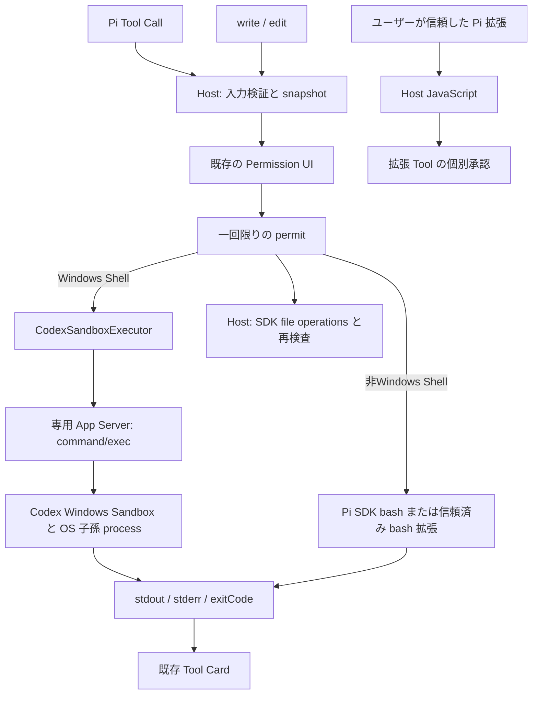

# Phase 11: Sandbox / Approval Architecture

2026-09-24 の Phase 11 再実装仕様に基づく実装・検証記録。**実行委譲は main へマージ済みだが、Phase 11 全体は未完了**。2026-09-25 の追加検証で C04 と C09 を確認した。C03 の Sandbox 未準備状態は、検証用 Windows 環境がないためユーザーの指示により実機未検証として残す。通信隔離の既知の制約は維持する。利用者の Trust 設定は変更していない。

## 2026-09-25 の追加修正と受入

検証対象は `df1289f5a260906d8dcba715acaf9b791e427c96` に今回の差分を加えた作業ツリー。再実装のマージコミットと今回の未コミット差分を区別する。結果の要約は [追加検証記録](Sandbox-Approval-followup-validation.json) に保存した。

- **C03：実機未検証を維持。** `notConfigured` / `updateRequired` での実行拒否、取消し、承認の再利用拒否は単体テストで確認した。未準備の実機と、未準備状態からのセットアップ操作は確認していない。既存端末の設定を壊して再現しない。
- **C04：確認。** pwsh は長い日本語出力が成功しても、短い `日本語 $literal` のファイル読出しが文字化けした。Windows PowerShell と同じ UTF-8 初期化を pwsh にも適用し、短い出力を含む回帰テストを追加した。受信後の推測による再デコードは行わない。Sandbox の受入テストも製品と同じ引数生成処理を使用する。
- **C09：確認。** 導入済みの `pi-web-access` `0.30.0` を検証用の設定で明示的に信頼し、実ロード、ツール登録、承認後の `https://example.com/` 取得に成功した。未信頼時は未ロード、拒否時は HTTP 要求が0件であることを確認した。localhost は拡張自身の内部アドレス保護により拒否されたため、保護設定を変更せず公開ページを使用した。モデル API は呼び出していない。
- **C14：未完了。** 実 VS Code の Webview、Extension Host、実 App Server を通した許可・拒否・実行中 Stop・ウィンドウ再読込み後の再接続と再実行を確認した。モデル応答だけをローカルサーバーで模擬し、承認や Sandbox 実行は製品経路を使用した。未準備状態の実機確認と、今回の差分を新しいコミット上で確定する作業は残る。
- **C15：文書同期済み。** 再実装のマージ状態、現在の文書配置、C07 / C08 の判定、今回の結果を反映した。Phase 11 全体の完了を意味しない。

実行結果：型・Lint、単体テスト72ファイル / 466件、配布物テスト19件、ビルド、Pi SDK 統合が成功した。`test:pi:shell` は11件、`test:pi:web` は3件、`test:sandbox:ui` は4件成功した。Windows 受入は20件成功、通信隔離3件失敗、HTTPS の失敗理由1件未検証、別途観測4件で、終了コード1を維持する。通信到達を遮断成功に読み替えない。

再実行する場合は、ビルド完了後に次のコマンドを使う。pwsh の選択は後述の `NERITA_SANDBOX_PWSH` を使用する。

```powershell
rtk pnpm test:pi:shell
rtk pnpm test:pi:web
rtk pnpm test:sandbox:ui
rtk pnpm test:sandbox
```

Shell の結果は `dist/pi-shell-smoke/results.json` に保存する。実拡張の結果は `dist/pi-web-access-smoke/results.json` に保存する。UI の結果は `dist/vscode-sandbox-smoke/results.json`、Windows 受入は `dist/sandbox-smoke/results.json` に保存する。

UI の画像保存先は結果 JSON の `artifacts` を参照する。今回の画像で承認内容、日本語出力、停止表示、再接続後の結果を確認し、Webview のエラーは0件だった。setup と利用不能状態の画面操作は未検証。UI の検証は一時プロファイルと専用ワークスペースを使用し、通常のユーザー設定を変更しない。

## 基点と変更範囲

| 項目                 | 値                                                                                                  |
| -------------------- | --------------------------------------------------------------------------------------------------- |
| 作業ブランチ         | `phase11-codex-reimplementation`                                                                    |
| 着手時の main / HEAD | `b553e7665f2cee21e7c4a8490be09d41fc2ba8a8`                                                          |
| 選択参照した保存版   | `e5f31d606a09722e93f78b5ec7aa3682adaefeb7` (`phase11-astra`)                                        |
| 実装の状態           | `f41bdc932fa743551b3f62c89a5ba3b462fd69a6` で main へマージ済み。今回の追加修正は別の作業ツリー差分 |

Notion 記載の旧 main へ戻さず、着手時の main を維持した。新しい依存パッケージ・lockfile 変更・backend 切替の再設計・アニメーション変更は含まない。

保存版の permit、command/config 応答検証、PowerShell 探索、導入済みリソース解決、子 Runtime の追跡を選択参照した。policy、ファイル操作、Runtime 接続、テストの期待値は今回の仕様に合わせて作り直した。常時拒否の通信検査、範囲を限定した読み取り、独自の保護ルート、拡張の一律拒否は採用していない。Win32 broker、通信診断の no-op、`--filesystem-only` も採用していない。生成済み App Server 型は変更していない。

## 責務と実行経路



- Windows のシェルの OS による隔離は同梱 Codex に委譲する。Windows 以外では通常の Pi シェルを使用する。Nerita は実行要求の固定、承認、接続、出力、停止を担当する。
- `read` / `ls` は SDK の Host I/O。通常の外部ファイルの読取りを許可する。任意のパスを必ず読める保証ではない。
- `write` / `edit` は Host 側のアダプターを使う。実体パス、既存の祖先ディレクトリ、内容、ファイルの識別情報、ハードリンクを検査する。承認中の内容変更・リンク差替えは拒否する。
- Host の検査と実際の入出力の間には競合の余地がある。別プロセスが継続的に差し替える場合まで、OS サンドボックスと同じ強度で防ぐ保証はない。開いた既存ファイルの識別情報の確認と、新規作成時の `wx` 指定は追加の防御であり、Host の入出力を OS で隔離するものではない。
- 明示的に信頼した拡張と依存先の JavaScript は Host の権限で動く。初期化、独自プロセスの起動、HTTP 通信は、ツールの承認やシェルの通信設定による隔離対象ではない。
- プロバイダーの API、認証、履歴も Host の機能である。シェルの通信制限と混同しない。

### 実行基盤の選択と他の Sandbox

Windows のシェル ツールの説明は「設定された Sandbox Executor を通す」とし、共通の承認表示は `実行範囲: Shell Sandbox` とする。実装名と固有の設定は、選択された Executor の `describe()` から取得し、承認対象の snapshot に含める。現在の Codex 実装であれば `Sandbox実装: Codex` と Windows の設定を表示する。別の Executor に Codex / Windows の表示を付けることはしない。

Windows では Codex 用 `Executor` を使う。Windows 以外では Codex の設定取得・`Executor` 生成・サンドボックスセットアップを行わず、Pi SDK 標準の`bash`を登録する。サンドボックスがないことを利用不能理由やエラー通知にしない。`read` / `ls` / `write` / `edit`も利用できる。Windows のサンドボックス失敗時に Host シェルへ切り替える処理ではない。

非 Windows では SDK の`shellPath` / `shellCommandPrefix`設定を維持する。Nerita は`@anthropic-ai/sandbox-runtime`を自動検出・導入しないが、明示的に信頼した Pi 拡張による`bash`の置換を許可する。その拡張が提供するサンドボックス処理を実行でき、Nerita の承認・`role` のシェル禁止・取消しも適用する。実パッケージと macOS / Linux 実機での共存は未検証。

通常の非 Windows 承認は`実行範囲: Pi Shell（OSの権限で実行）`と表示する。Windows Sandbox の情報や Nerita が強制していない書込み・通信制限は表示しない。外部拡張が自身で加える隔離の強度も Nerita 側では保証しない。非 Windows の`bash`以外の組み込みツールの上書きは拒否する。

### シェルの権限設定

`AgentAccessPolicy` はワークスペースのルート、書込み可能なルート、通信とシェルの許可、Windows のサンドボックス実装だけを持つ。Windows の Pi シェルは VS Code のワークスペースを実体パスへ変換し、その配下に書込みを限定して `networkAccess=false` を送る。以下の OS 制約は Windows のサンドボックスに対する要求であり、Windows 以外の Host シェルには適用しない。Host のファイルツールのパス検査と `role` によるシェル禁止は両方の環境で適用する。

```json
{
	"type": "workspaceWrite",
	"writableRoots": ["<canonical workspace roots>"],
	"networkAccess": false,
	"excludeTmpdirEnvVar": true,
	"excludeSlashTmp": true
}
```

書込み可能なルートが空の子には `readOnly` を指定する。作業ディレクトリはワークスペース内に限定する。`workspaceWrite` では、作業ディレクトリが書込み許可範囲外なら実行を拒否し、Codex が暗黙に書込み範囲を広げることを防ぐ。実行直前にも作業ディレクトリと各ルートの実体パスを再検査する。TEMP/TMP と `/tmp` への書込み例外は有効化しない。Codex 自身の保護や OS のアクセス権は解除しない。独自の読取り許可範囲や `.ssh` の読取り禁止はシェルの権限設定に追加していない。

Windows 実装は `config/read` の実効値を使う。未指定だけ `elevated`。既存の `unelevated` を黙って切り替えず、承認画面に実装と通信隔離の弱さを表示する。今回の実機記録は elevated のみであり、unelevated の通信隔離は未検証。

通常の Codex バックエンドの権限モードや環境変数の継承は維持する。シェル専用接続では、Windows の実装、`shell_environment_policy.inherit="none"`、`set={}` を固定する。シェル実行 RPC の `env` でも不要な継承変数を `null` で除去し、プロバイダーのトークンを渡さない。環境変数の値は承認表示・診断ログへ出さない。

### 承認と停止

コマンド引数、作業ディレクトリ、環境変数、制限時間、権限設定、ファイルパスと内容を承認前に複製し、入れ子の値も変更不能にする。Host 内の WeakSet に登録した実行許可を1回だけ消費する。許可のコピー・偽造・再利用や、取消し済みの要求は受け付けない。この仕組みは拡張の JavaScript 自体を隔離するものではない。

`read` / `ls` は承認不要。write、edit、powershell、pwsh、bash、外部拡張 Tool は毎回承認する。`node --version` も例外にしない。Windows シェルの承認表示には cwd、操作、書込み範囲、実 argv、制限時間、Windows 実装、Shell network 設定を載せる。非 Windows の `bash` には操作と `cwd`、Pi シェルの実行範囲を載せる。ファイル Tool と通常の拡張 Tool は Host / Sandbox 外と表示する。

Windows のシェルは実行ごとに専用接続を使う。停止、時間切れ、切断、正常終了時にはコマンドの終了を要求し、専用 App Server とその子孫プロセスを終了する。取消処理と `finally` は同じ終了処理の Promise を待つ。接続初期化中に取り消された場合も、エージェントのコマンドを起動しない。Windows で失敗しても、`process/spawn`、`thread/shellCommand`、SDK の Host シェル、Host による直接のプロセス起動へは切り替えない。Windows 以外では Pi SDK または信頼済みの `bash` 拡張に実行と取消しを委譲する。

## 利用と設定移行

1. Windows x64 のローカル VS Code で信頼済み workspace を開き、Pi に接続する。
2. Sandbox が未準備なら、コマンドパレットから `nerita.pi.setupCodexWindowsSandbox` を明示的に実行する。表示名は「Nerita: Pi 用の Codex Windows Sandbox をセットアップ」。Windows かつ Pi バックエンドの場合だけ登録・表示・有効化し、実行時にも条件を確認する。Codex バックエンドからは開始できない。セットアップ完了通知を確認して Pi へ再接続する。会話開始時に自動セットアップはしない。
3. `powershell` / `pwsh` の承認内容を確認して許可する。readiness 未完了、設定不一致、RPC 拒否は理由を表示する。network=false は Shell の起動禁止条件ではない。
4. 外部 Pi 拡張を使う場合、導入済みパッケージの entry を確認し、VS Code の**ユーザー設定**に単一ファイルの絶対パスを列挙して再接続する。

Windows 以外ではサンドボックスセットアップは不要で、コマンドも登録・表示しない。Pi シェルは既存の SDK 設定で動作する。この分岐の追加は、現在 Windows x64 向けの VSIX 配布対象を拡大するものではない。

```json
{
	"nerita.pi.trustedExtensionPaths": ["<canonical absolute entry file>"]
}
```

信頼する拡張には単一ファイルを指定する。パスの区切りは正規化するが、ディレクトリ指定やシンボリックリンク・ジャンクション経由の別名は受け付けない。設定の `globalValue` だけを採用し、ワークスペースの同名設定からは許可できない。ワークスペース内の拡張には Workspace Trust も必要になる。組み込み拡張は維持する。外部ツールによる組み込みツールの上書きは、Windows 以外の `bash` を除いてエラーにする。設定から外したファイルは再接続後にロードされない。実行中の拡張の信頼を取り消す UI は今回の範囲外。

SDK の自動探索で見つかった未信頼の拡張コードはロードしない。スキル、プロンプトテンプレート、プロバイダー固有の設定、その他の設定、履歴は維持する。導入済みのローカルパッケージを参照し、新規会話や再接続では npm / Git から自動取得しない。

### powershell / pwsh と UTF-8

Windows PowerShell と PowerShell 7 は別のツールとして登録し、相互の自動切替をしない。

| Tool         | 対応する Shell                        | 解決・公開条件                                                                         |
| ------------ | ------------------------------------- | -------------------------------------------------------------------------------------- |
| `powershell` | Windows PowerShell (`powershell.exe`) | `SystemRoot` 配下の OS 標準配置のみ。解決不能なら具体的な理由を返す                    |
| `pwsh`       | PowerShell 7 (`pwsh.exe`)             | 通常の導入先と PATH を探索。Sandbox 内で Core / 7 以降の起動確認に成功した場合だけ公開 |

MSIX の WindowsApps 配置、そこへのリンク、workspace の書込み範囲内にある実行ファイルは使わない。`pwsh` が未導入・起動不能でも `powershell` は維持する。インストール・アンインストールは行わず、環境の変更は Pi への再接続時に反映する。

`pwsh` の起動確認は接続時の固定処理で、モデル入力やユーザーの command を含まない。同じ Sandbox Executor / policy を通し、5 秒の制限を付ける。モデルが呼ぶ Shell Tool の承認は毎回必要。

Tool と `command` パラメータの説明には、対応 Shell と「`node --version` のように本文を直接渡す」使い方を明記する。これらは実 SDK がモデルへ送る Tool 定義に含まれる。説明で不要な `pwsh -Command ...` 等の二重起動を避けるよう促すが、コマンド本文を自動で書き換えるものではない。

Windows PowerShell と pwsh の両方で、ユーザーの本文の前に次の3つを設定する。

```powershell
$OutputEncoding = [System.Text.Encoding]::UTF8
[Console]::InputEncoding = [System.Text.Encoding]::UTF8
[Console]::OutputEncoding = [System.Text.Encoding]::UTF8
```

実機の ConstrainedLanguage では Console の setter が拒否される。その前に OS 標準の `chcp.com 65001` で Console のコードページを設定する。PowerShell 側の出力リダイレクトは古いコードページをキャッシュすることを実測した。このため、固定の `cmd.exe /d /c` 内で chcp の表示だけを抑制する。実行ファイルは `SystemRoot` 基準のフルパスを使用する。制約言語・ExecutionPolicy・Sandbox 設定は変更しない。

setter が拒否されてもコードページを確認し、既に 65001 なら継続する。65001 にならなかった設定は警告として結果に残す。初期化を含む平文 `-Command` の本文は単一 argv として承認対象になる。`-EncodedCommand` は使わず、stdout / stderr は終了時にまとめて表示する。ファイル保存の既定エンコーディングは変更しない。指定された `Encoding.UTF8` は BOM 付きであり、native へのパイプでも BOM 付きになる場合がある。

## Host 子 Runtime

`createPiRuntime()` の戻り値が `children.open({ cwd?, role, signal? })` を提供する。親の確定済み権限と子の `role` の両方で許可された権限だけを採用する。実行基盤、承認先、Windows の実装、利用不能理由は親から引き継ぎ、子から差し替える API は提供しない。

親を停止すると、起動中、承認待ち、実行中の子・孫も停止する。子の履歴は `SessionManager.inMemory()` でメモリー内に保持し、親の保存先設定、再開対象、モデル保存のコールバック、外部拡張の信頼設定を引き継がない。モデル向けの委譲ツールや UI は追加していない。信頼済み外部拡張が独自に起動するサブエージェントは、この管理の対象外となる。

## 検証記録

検証対象は上記 HEAD に今回の作業ツリー差分を適用したもの。環境は Windows `10.0.26200` x64、Node `v24.18.1`。同梱 Codex は `0.156.0`、Pi SDK は `0.87.1`。Windows Sandbox は `elevated`、readiness は `ready`。VS Code 結合テストは `1.139.0`。

| 実行                              | 結果と範囲                                                                                                                                                                                                 |
| --------------------------------- | ---------------------------------------------------------------------------------------------------------------------------------------------------------------------------------------------------------- |
| `rtk pnpm check`                  | Lint・Host / Webview / Stories / tests 型検査が成功                                                                                                                                                        |
| `rtk pnpm test:unit`              | 71 files / 455 tests 成功。U01〜U12、OS 別のツール選択、セットアップの非 Windows 除外、Shell 別の探索・公開・承認、既存回帰                                                                                |
| `rtk pnpm compile`                | 開発ビルド成功                                                                                                                                                                                             |
| `rtk pnpm test:runtime`           | 19 tests 成功。移設した Runtime、公開 API、provider chunk、拡張 SDK import、画像 WASM、ライセンス・更新処理                                                                                                |
| `rtk pnpm test:pi:chat`           | 実 SDK＋模擬モデル＋本番 Sandbox Executor。承認 / 拒否 / Stop / 切断再接続、履歴、provider controls、明示 Trust 拡張、Host 子・孫 Runtime。追加の OS 模擬4ケースで通常 `bash` と信頼済み `bash` 置換を確認 |
| `rtk pnpm test:pi:shell`          | 本番 Shell Tool と Sandbox で 7 cases 成功。両 Shell の選択・Node・承認拒否、Windows PowerShell の UTF-8 / 日本語 stdout・stderr / pipe / exit 7。既存 portable pwsh を明示指定                            |
| `rtk pnpm test`                   | 実 VS Code Extension Host の 6 tests 成功。Pi SDK / file 承認 / Stop / 履歴、Codex 初期化、Webview 資産                                                                                                    |
| `rtk pnpm ui-review pi-approvals` | 8 tests 成功。write / powershell / pwsh / bash、320px、light / dark、長い argv と policy、許可 / 拒否 / 取消し / Stop、console / page error 検査。生成画像を変更前後で目視確認                             |
| `rtk pnpm test:sandbox`           | Windows 本番 Executor の受入。通信と日本語出力の失敗を含むため exit 1。詳細は下記                                                                                                                          |

`rtk pnpm test:codex:chat` も認証済みモデルで返信・中断・同一会話の継続に成功した。既存 smoke は Node 単独で `vscode` を解決できず build で止まったため、Pi smoke と同じ空のエディター API 境界を追加した。エディター操作は利用できず、Codex の接続やモデル応答は実物を使う。この試験は network 比較ではない。

実行基盤の表示修正では、関連する単体テスト4ファイル・31件を確認した。macOS / Linux の判定で Codex 用 Executor が接続・実行しないことを含む。別 Executor の表示に Windows 固有情報を加えないことや、承認待ちの表示情報を変更不能にすることも確認した。OS 判定は Windows 上の単体テストで模擬したもので、macOS / Linux 実機の検証ではない。表示修正前の UI 記録は `dist/ui-review-history/sandbox-wording-20260925-090641/before/`。

非 Windows の通常 Pi シェル対応では、`piPlatformTools.test.ts` で Codex の設定取得・Executor の生成が呼ばれないことを確認した。SDK の bash の承認・設定継承・実行結果、write/edit の実際の入出力も検証した。拒否・role による禁止・承認中の Stop、信頼済み bash への置換も確認した。`sandboxSetup.test.ts` では macOS / Linux の登録・接続・通知がないことを確認した。

セットアップコマンドの Pi 限定・改名では、`sandboxSetup.test.ts`と`sandboxExecutor.test.ts`の16 tests が成功した。Codex またはバックエンド未指定時の未登録、Pi で登録後に Codex 設定へ変えた場合の直接呼出し拒否、Windows の Pi でのセットアップ完了・接続回収を確認した。コマンドパレットの表示・有効条件と旧 ID の廃止もマニフェストで検証した。

`pi-platform-smoke.mjs` は配布 SDK・本番 Runtime・模擬モデルを通して検証した。macOS / Linux の判定それぞれで、通常の bash による `node --version` と、明示的に信頼した bash 拡張への置換を確認した。モデルへのツール公開と1回の承認も確認している。実行 OS は Windows で、通常の bash には既存の Git Bash を使い、OS 判定だけを模擬した。**macOS / Linux 実機や実際の sandbox-runtime との結合検証ではない**。非 Windows 対応前の UI 記録は `dist/ui-review-history/pi-host-shell-20260925-092925/before/`。対応後は `dist/ui-review/report/` で、bash の承認待ち・完了表示を明暗で確認した。Windows 側の画像が変更前と一致することも確認した。

build / package は `dist/runtime` を作り直すので SDK / Windows smoke と同時実行しない。受入は専用の内側・外側 fixture だけを作り、削除前に絶対パスを検査する。ユーザーデータ、AV、Firewall、ExecutionPolicy は変更しない。

Shell 分離前の Windows 受入は **18 pass / 5 fail / 1 unverified**（別途 network の観測記録 4 件）。当時の各ケースと network 比較の argv・policy・応答は [検証 JSON](Sandbox-Approval-validation.json) に保存する。ローカル絶対パスは `<fixture>` / `<extension>` 等に置換してあり、そのまま実行する入力ではない。再実行時のローカル診断出力先は `dist/sandbox-smoke/results.json`。fixture はテスト後に削除する。

2026-09-25 の Shell 分離・UTF-8 修正は `test:pi:shell` で追加検証した。結果は `dist/pi-shell-smoke/results.json`。3設定すべての CodePage=65001、ConstrainedLanguage の維持、短い日本語 stdout を確認した。native の UTF-8 stderr と明示 `exit $LASTEXITCODE` による exit 7、日本語 pipe も確認した。全体の network 受入は再実行しておらず、過去の失敗を成功へ書き換えていない。UI の変更前は `dist/ui-review-history/shell-tools-20260925-083321/before/`。変更後は `dist/ui-review/report/` と `dist/ui-review/test-results/`。write / powershell / pwsh、長い argv、UTF-8 設定失敗時の警告を確認した。明暗・320px・承認 / 拒否 / 取消し / Stop も確認した。

### 実機の既知の失敗・未検証

| 対象                  | Host 対照 | Codex command/exec 直結 | Pi 製品 Tool → 承認 → Executor | 判定                                     |
| --------------------- | --------- | ----------------------- | ------------------------------ | ---------------------------------------- |
| IPv4 loopback HTTP    | 到達      | 到達                    | 到達                           | **fail: network=false の隔離未達**       |
| IPv6 loopback HTTP    | 到達      | 到達                    | 到達                           | **fail: network=false の隔離未達**       |
| `http://example.com`  | 到達      | 到達                    | 到達                           | **fail: network=false の隔離未達**       |
| `https://example.com` | 到達      | SSL 接続失敗            | SSL 接続失敗                   | **unverified: 通信遮断の証明にならない** |

network 比較では、実 SDK の PowerShell Tool 定義と製品アダプターが生成した要求を観測する。executable / argv / cwd / env / timeout / policy / Windows 実装を揃えて、直結・Host を実行する。観測用ラッパーは実 Executor を呼び、結果を置き換えない。SDK＋模擬モデルの Tool Call 経路は別の `test:pi:chat` で検証している。Codex バックエンドの通常モデルターンによる同条件の network 比較は**未検証**。直結と Pi の一致は原因の切分けに使うが、通信テストの合格へ読み替えない。上流または Windows 実行環境のどちらが原因かは未確定。

修正前の W09: 短い `Write-Output '日本語 $literal'` が exit 0 でも `“ú–{Śę $literal` と返った。Windows PowerShell の製品 Tool 経路と、pwsh の短い日本語ファイル出力で再現した。最初の修正では Windows PowerShell だけを確認していたが、今回 pwsh にも UTF-8 初期化を適用し、W09 と両シェルの製品 Tool 経路で成功した。ファイルの UTF-8 内容と出力表示を別に検査し、受信後の推測による再デコードは実装していない。

この端末の PATH の pwsh は MSIX 版で、Sandbox ユーザーから `CreateProcessAsUserW failed: 5` となる。製品はこの配置を除外して `pwsh` Tool を公開しない。`powershell` Tool は独立して Windows PowerShell を使う。pwsh 自体の受入には、既存の署名済み portable 実行ファイル `dist/sandbox-smoke/pwsh/pwsh.exe` を使用した。ダウンロード・インストール・製品設定変更は行っていない。テスト専用の実行ファイル選択は次のとおりで、Executor / policy を差し替えるものではない。

```powershell
rtk proxy pwsh -NoProfile -Command '$env:NERITA_SANDBOX_PWSH = (Resolve-Path "dist/sandbox-smoke/pwsh/pwsh.exe").Path; pnpm test:sandbox'
```

同じ環境変数で `pnpm test:pi:shell` を実行する。指定された実行ファイルのディレクトリをテストプロセスの PATH へ一時追加し、製品の探索・起動確認・ツール登録から検証する。

通常配置の pwsh がない環境で override を指定しない場合、`test:sandbox` は pwsh を skip と記録する。`test:pi:shell` は未検証として終了コード1を返す。Windows PowerShell の重複実行を pwsh 成功とは扱わない。Windows Sandbox の streaming command/exec は同梱版で拒否されたため、製品は要求しない。

I08: 実 SDK package manager で `pi-web-access` `0.30.0` の導入を確認した。package の宣言は `./dist`、Pi agent directory からの相対 entry は `npm/node_modules/pi-web-access/dist/index.js`。初回は未検証だったが、追加の `test:pi:web` で明示 Trust による実ロード・Tool 登録・HTTP 操作を確認した。`pi-web-search` は未導入で、別 package へ置き換えていない。I05 の fixture 検証も維持する。

実 VS Code の Sandbox 出力・承認・拒否・停止・再接続は、追加の `test:sandbox:ui` と画像確認で検証した。setup コマンド操作と利用不能理由の画面表示は**未検証**。Sandbox の未設定 / 更新必要状態は unit で検証し、この端末の setup 状態を壊して再現していない。

### 完了条件との対応

「確認」は作業ツリーでの範囲を指し、新しい実装 commit・リリースの承認を意味しない。

| 条件                              | 対応する証拠                                                                      | 状態         |
| --------------------------------- | --------------------------------------------------------------------------------- | ------------ |
| C01 通常 Pi Shell                 | I01、実 SDK smoke、W01                                                            | 確認         |
| C02 同一 snapshot / fallback 不在 | U02/U03/U07/U08、Executor review、I01                                             | 確認         |
| C03 拒否 / Stop / 無効要求        | U03〜U06、I02/I03。実機の未準備状態は未検証                                       | 一部未検証   |
| C04 3 種の executable と出力      | W01 / W09、追加の Shell 11件。pwsh の短い日本語出力を修正し再検証                 | 確認         |
| C05 read / write / 子孫境界       | U09、I04、W02〜W07                                                                | 確認         |
| C06 回収 / 他接続                 | I03/I07、W08。counter・開始 marker で実行と停止を確認                             | 確認         |
| C07 Codex / Pi 比較               | 同条件比較に加え、Codex CLI 単体でも同じ外部 TCP 到達を再現した記録を確認         | 確認         |
| C08 通信                          | Nerita 固有ではないと切り分け済み。完全遮断を保証しない契約。W10 の観測失敗は保持 | 制約確認済み |
| C09 明示 Extension Trust          | U10、I05、実 pi-web-access の未信頼・拒否・承認後 HTTP の3件                      | 確認         |
| C10 既存 SDK 機能                 | I06、SDK persistence / packages smoke、Runtime 配布 19 tests                      | 確認         |
| C11 file Tool                     | U02/U09、I04、変更・junction・hard link テスト。本書に Host 競合限界              | 確認         |
| C12 Host 子・孫                   | U12、I07。権限非拡大、承認待ち / 実行中 Stop、起動競合、履歴分離                  | 確認         |
| C13 旧拒否仕様の除外              | source / script / setting 検索と差分レビュー                                      | 確認         |
| C14 全検証と新 commit             | 自動検証と実 VS Code UI は追加確認。未準備の実機確認・追加差分のコミットは残る    | **未完了**   |
| C15 文書・設定・差分              | マージ状態・文書配置・制約・受入結果を同期。依存更新なし                          | 文書同期済み |

U01〜U12 の主な検証元は次の5ファイル。

- `sandboxPolicyApproval.test.ts`
- `sandboxExecutor.test.ts`
- `piSandboxTools.test.ts`
- `piChildRuntimes.test.ts`
- `piResourceSettings.test.ts`

I01〜I07 は `pi-chat-smoke.mjs` とそこから呼ぶ persistence / packages / subagent smoke。W01〜W10/W12 は `sandbox-smoke.mjs`。W11 は単体テストのみで、OS の未準備状態を pass と記録しない。

## 残る作業

- C03 の未準備状態と、その状態からの setup 操作を実機未検証として残す。専用環境がないため、既存環境を変更して再現しない。
- 今回の追加差分を新しいコミットで確定し、C14 の受入記録と対応付ける。再実装自体の main マージは完了済み。
- 通信隔離は Codex CLI 単体でも到達することを確認済み。C07 / C08 の切り分けは完了とし、Codex / Windows 側の改善を追跡する。完全遮断は保証せず、W10 の失敗結果を保持する。

コマンドの詳細な危険度解析は Phase 11-1、取得元・ルート別の信頼設定と取消 UI は Phase 11-2 で扱う。読取り許可範囲・拒否対象パスの OS による強制、拡張 JavaScript の隔離、Host のファイル入出力のサンドボックス化、独自の通信プロキシは別途設計する。

公式 API の参照先: [Codex App Server](https://learn.chatgpt.com/docs/app-server)、[Windows Sandbox](https://learn.chatgpt.com/docs/windows/windows-sandbox)。機能の可否は同梱版の生成型と今回の実測を優先して記録した。
